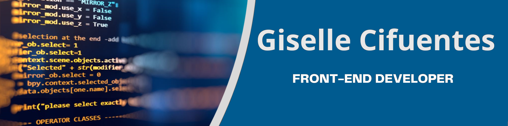
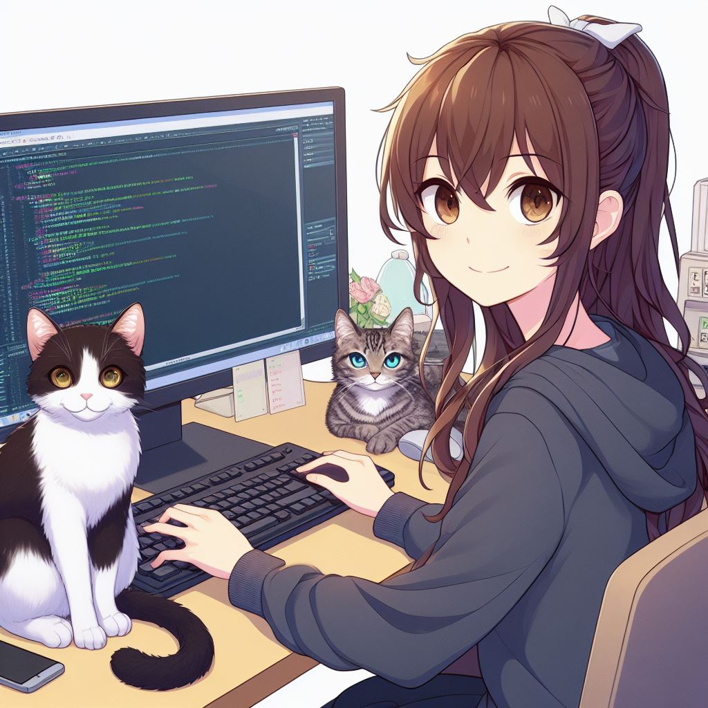

  

<h1 align="center">
  
</h1>
<h3 align="center">A passionate frontend developer from Chile  </h3>

 

  

  <h3>About Me:</h3>
  
    <ul>
      <li>🐾 Veterinarian who became a developer</li>
      <li>🎮 Fanatic of playing video games</li>
      <li>🎾 Enjoys playing tennis in free time</li>
      <li>💻 Web Development Enthusiast</li>
      <li>📱 Aspiring Mobile App Developer</li>
      <li>🧠 Curious about Artificial Intelligence</li>
      <li>📫 How to reach me <a href="mailto:vet.nat.c@gmail.com">vet.nat.c@gmail.com</a> </li>
      <li>🌐 Visit my portfolio <a href="https://navy-bovid-409.notion.site/Nat-Home-2c02f940f7834dea9ad56cd6e1079b6f" target="_blank">here</a> to see my projects and learn more about me!</li>
    </ul>

### Courses:
- 🚀 Completed a Front-End Web Development Bootcamp at [Laboratoria](https://www.laboratoria.la)
- 📚 I'm currently learning React and Bootstrap
- 🌟 Finished the Tailwind course on [Platzi](https://platzi.com)
- 🐍 Learning Python at [CodigoFacilito](https://codigofacilito.com/)
- ☕ Taking Java classes at [Laboratoria](https://www.laboratoria.la)
- 🌱 Finished the Back-End Development Seedling Program at [Incubadora de Desafío Latam](https://desafiolatam.com/incubadora/)
- 🎓 Taking Vue.js Classes at [Udemy](https://www.udemy.com)
- 📱 Participating in a Mobile Application Development Bootcamp for Android

<h3 align="left">Connect with me:</h3>

<h3 align="left">Languages and Tools:</h3>

<!--

          
-->

<h3 align="left">🔥 My Stats:</h3>

&nbsp;

 

### 🎮 My Pokémon Unite Main Team:

  

---

  
  

<!--
<h1 align="center">Hi 👋, I'm Giselle Cifuentes</h1>

**NatSama2/NatSama2** is a ✨ _special_ ✨ repository because its `README.md` (this file) appears on your GitHub profile.

Here are some ideas to get you started:

- 🔭 I’m currently working on ....
- 🌱 I’m currently learning ...
- 👯 I’m looking to collaborate on ...
- 🤔 I’m looking for help with ...
- 💬 Ask me about ...
- 📫 How to reach me: ...
- 😄 Pronouns: ...
- ⚡ Fun fact: ...

-->
